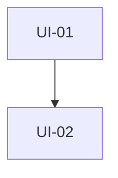

# Crear plan de implementación

## Propósito, límites y relación con PRD y SPEC

Transforma un **PRD aprobado**, su **SPEC asociado** y el contexto técnico estrictamente pertinente en un plan de implementación ejecutable, verificable y trazable. El plan responde **en qué orden se realizará el trabajo y cómo se demostrará cada avance**; no redefine qué producto se construye ni cómo debe comportarse.

El flujo documental es:

```text
crear-prd → docs/prd/<iniciativa>-prd.md
crear-spec → docs/spec/<iniciativa>-spec.md
crear-plan-implementacion → docs/planes/<iniciativa>-plan-implementacion.md
implementación y validación por unidades
```

- `crear-prd` define problema, valor, alcance, exclusiones, capacidades y éxito.
- `crear-spec` define comportamiento, requisitos, criterios de aceptación, interfaces, datos, errores y decisiones técnicas.
- Esta skill organiza decisiones ya confirmadas en unidades de implementación, dependencias, cambios previstos y evidencia.

No implementes código, no modifiques configuración, PRD, SPEC ni contenido de `knowledge/`, y no crees tareas en servicios externos. No inventes arquitectura, archivos, componentes, pruebas, contratos, dependencias, estimaciones ni decisiones ausentes. No impongas una metodología, duración, número de subtareas ni tamaño basado en líneas de código.

Distingue siempre información confirmada de `Supuesto`, `Pendiente`, `Por validar` y `Bloqueante`. Si una contradicción o vacío impide delimitar, ordenar o validar honestamente el trabajo, detente: explica el bloqueo y recomienda actualizar primero el PRD o SPEC correspondiente. Un plan con bloqueos puede mostrarse como borrador de orientación, pero nunca presentarse como listo para ejecutar.

## Reglas documentales y de seguridad

- Lee completamente el PRD y el SPEC antes de proponer unidades o inspeccionar el repositorio en detalle.
- Comprueba que corresponden a la misma iniciativa y que el SPEC enlaza, cita o se corresponde inequívocamente con el PRD indicado. Comprueba también compatibilidad entre objetivos, alcance, exclusiones, requisitos y criterios.
- Solicita las rutas del PRD y SPEC si no se indicaron; no reconstruyas el producto desde un SPEC ni sustituyas un SPEC con un plan.
- Los planes aprobados viven únicamente en `docs/planes/`. Los borradores solo se muestran en la conversación.
- `knowledge/` es exclusivo de la persona usuaria: consúltalo solo si una fuente revisada lo enlaza o la persona lo indica; nunca lo modifiques, muevas, clasifiques ni uses como destino.
- Revisa `AGENTS.md`, README e instrucciones locales aplicables solo a las zonas que necesites inspeccionar. Explora de forma acotada los componentes, interfaces, datos, configuración, pruebas y documentación nombrados por el SPEC o necesarios para ubicar el cambio.
- Registra las fuentes técnicas realmente consultadas. Si no se puede confirmar una ruta, prueba o componente, indícalo como `Por validar`.
- Usa español salvo que la persona usuaria solicite otro idioma.
- Usa minúsculas, palabras separadas por guiones y el sufijo `-plan-implementacion.md`: `docs/planes/<nombre-iniciativa>-plan-implementacion.md`. Si el nombre es ambiguo, pregunta antes de fijarlo.
- Usa enlaces Markdown relativos solo a fuentes locales que hayas consultado y verifica que funcionen desde `docs/planes/`.
- No crees directorios ni escribas o actualices archivos hasta mostrar el borrador completo o suficientemente representativo, la ruta propuesta y todos los archivos que se crearían o actualizarían, y recibir aprobación explícita. El silencio o una respuesta ambigua no autorizan la escritura.
- Si existe un plan, léelo completo antes de proponer cambios. Explica qué decisiones se conservan, qué cambia y por qué. Tras la aprobación, vuelve a leer el destino; si cambió, detente y explica la diferencia antes de sobrescribir.
- No añadas YAML al plan salvo que una convención existente lo requiera.

## Criterios de preparación

Antes de planificar, extrae del PRD: iniciativa, objetivo, alcance, exclusiones, capacidades, éxito, dependencias y riesgos. Extrae del SPEC: requisitos (`RF-XX`), criterios de aceptación (`CA-XX`), flujos, reglas, decisiones técnicas, contratos, datos, errores, requisitos no funcionales, pruebas, riesgos y pendientes.

La documentación está preparada cuando permite identificar con suficiente certeza:

- qué requisitos y criterios están dentro del alcance;
- qué resultado observable debe producir cada cambio;
- qué decisiones, contratos, datos o integraciones condicionan el orden;
- qué evidencia puede demostrar la terminación.

Marca como `Bloqueante` y no declares el plan listo, por ejemplo, si falta el PRD o el SPEC, pertenecen a iniciativas distintas, hay alcance incompatible, o una decisión abierta impide planificar un contrato, una migración, seguridad, integración o aceptación. Los vacíos no bloqueantes pueden permanecer como `Supuesto`, `Pendiente` o `Por validar`, indicando impacto y evidencia o responsable para resolverlos si se conocen.

## Unidades de implementación

Una **unidad de implementación** (`UI-01`, `UI-02`, etc.) es una parte ejecutable del plan con un único resultado técnico o de comportamiento. Debe:

- cubrir uno o varios requisitos relacionados sin mezclar preocupaciones independientes;
- tener contexto, responsabilidad y límites acotados;
- producir un resultado y evidencia verificables;
- incluir las pruebas, validaciones y ajustes documentales que introduce, no relegarlos artificialmente a una fase genérica;
- declarar condiciones de entrada, dependencias, riesgos y condición de terminación;
- dejar el repositorio integrable y comprobable. Si debe haber un estado transitorio, describe una estrategia segura de integración.

Favorece unidades verticales que permitan comprobar comportamiento de extremo a extremo. Separa una unidad si tiene resultados independientes, decisiones diferentes, responsabilidades sin relación funcional, dependencias distintas o evidencia imposible de revisar con claridad. Une unidades si separarlas crea pasos de «solo pruebas» o «solo documentación», trabajo sin resultado verificable o duplicación innecesaria de contexto.

No toda unidad debe desplegarse por separado, pero sí ser integrable y verificable honestamente. Para un cambio transversal grande, prioriza una trayectoria mínima extremo a extremo y ampliaciones incrementales cuando el SPEC permita esa secuencia.

Cada UI contiene como mínimo:

- objetivo y resultado observable;
- `RF-XX` y `CA-XX` cubiertos (y capacidad del PRD si aporta claridad);
- alcance incluido y excluido;
- cambios previstos por archivo, zona o componente, sin afirmar rutas no confirmadas;
- pasos concretos de implementación;
- pruebas o evidencia de validación;
- dependencias y condiciones de entrada;
- paralelismo posible;
- riesgos, supuestos o decisiones pendientes;
- condición de terminación.

## Dependencias, secuencia y paralelismo

Distingue dependencias obligatorias de preferencias de orden. Identifica contratos compartidos, migraciones, interfaces, zonas de conflicto, pruebas de integración y decisiones que deben estabilizarse antes de sus consumidores. Una unidad dependiente de un contrato todavía indefinido solo puede detallarse hasta donde permitan las fuentes; marca el resto como `Bloqueante` o `Por validar` y revísalo tras materializar el cambio previo.

Declara dos unidades paralelas únicamente si no tienen dependencia mutua, no modifican la misma responsabilidad central, no comparten un contrato inestable y el riesgo de conflicto es bajo. No llames «paralelo» a trabajo que requiere coordinación secuencial sobre la misma interfaz o migración.

Agrupa las UIs en etapas de ejecución y añade una comprobación final de integración, regresión y cobertura. Usa Mermaid cuando aclare una red de dependencias; para una secuencia sencilla, una lista es preferible. No inventes un diagrama para aparentar complejidad.

## Flujo

### Fase A: validar las fuentes

1. Determina si se crea un plan nuevo o se revisa/actualiza uno existente.
2. Solicita o identifica las rutas del PRD y SPEC. Si no hay PRD, solicita uno y recomienda `crear-prd`; si no hay SPEC, recomienda `crear-spec`.
3. Lee ambos documentos por completo. Si hay plan previo, léelo por completo también.
4. Comprueba relación PRD–SPEC, iniciativa, alcance, exclusiones, requisitos y criterios identificables. Resume las fuentes y las diferencias entre un plan previo y la propuesta.
5. Presenta contradicciones, carencias y bloqueos antes de continuar. No corrijas fuentes silenciosamente ni conviertas decisiones de producto o arquitectura en supuestos afirmativos.

### Fase B: orientar el plan en el repositorio

1. Parte de los componentes, interfaces, datos y dependencias que nombre el SPEC.
2. Lee las instrucciones locales aplicables e inspecciona solo los directorios y archivos necesarios para saber qué existe, dónde se ubicarían los cambios, qué responsabilidades o contratos se comparten y qué convenciones de pruebas hay.
3. Contrasta el SPEC con el estado actual. Registra discrepancias como riesgo, pendiente, `Por validar` o `Bloqueante` según su impacto.
4. Informa las fuentes técnicas consultadas; no explores todo el repositorio sin necesidad.

### Fase C: descomponer y ordenar

1. Construye una matriz inicial que cubra todos los `RF-XX` y `CA-XX` dentro del alcance, o justifique explícitamente exclusiones y pendientes.
2. Agrupa cambios por resultado comprobable y límites técnicos reales. Define las UIs y su evidencia.
3. Identifica dependencias obligatorias, puntos de integración, conflictos potenciales y paralelismo real según las reglas anteriores.
4. Ordena las UIs por etapas. Incluye validación y documentación en la UI que introduce el comportamiento.
5. Añade validación integral de integración, regresión, trazabilidad y documentación afectada.

### Fase D: redactar, aprobar y guardar

1. Redacta un borrador proporcional usando la plantilla. Omite secciones sin valor; no dejes secciones vacías ni marcadores ficticios.
2. Comprueba cobertura, condiciones de terminación, enlaces y que ningún bloqueo se presente como resuelto.
3. Muestra el borrador, ruta propuesta y todos los archivos a crear o actualizar. Solicita aprobación explícita.
4. Solo después de recibirla, relee el destino si existe; crea `docs/planes/` si hace falta y guarda exactamente el Markdown aprobado.
5. Verifica enlaces relativos. Comunica ruta final, primera etapa recomendada, bloqueos, supuestos, riesgos y revisiones futuras necesarias.

## Plantilla del plan

Usa esta estructura de forma proporcional:

````markdown
# Plan de implementación: <nombre de la iniciativa>

## Resumen
<Resultado que se implementará y enfoque general de ejecución.>

## Fuentes y alcance
- PRD: [<nombre>](../prd/<nombre>-prd.md)
- SPEC: [<nombre>](../spec/<nombre>-spec.md)
- Alcance incluido:
- Exclusiones relevantes:
- Fuentes técnicas revisadas:

## Estado actual y brechas
- Estado actual del repositorio:
- Capacidades reutilizables:
- Brechas respecto del SPEC:
- Supuestos o bloqueos:

## Estrategia de implementación
<Principios de descomposición, orden e integración aplicables.>

## Matriz de cobertura
| Requisito / criterio | Unidad | Evidencia prevista |
| --- | --- | --- |
| RF-01 / CA-01 | UI-01 | <prueba o comprobación> |

## Unidades de implementación

### UI-01 — <resultado concreto>
- **Objetivo:**
- **Cubre:** RF-XX, CA-XX.
- **Incluye:**
- **No incluye:**
- **Cambios previstos:**
  - `<ruta o componente>`: <responsabilidad del cambio>.
- **Pasos:**
  1. 
- **Validación:**
  - 
- **Depende de:** ninguna / UI-XX / decisión pendiente.
- **Puede ejecutarse en paralelo con:** ninguna / UI-XX.
- **Riesgos o pendientes:**
- **Terminado cuando:**

## Dependencias y secuencia


### Etapa 1
- UI-01

### Etapa 2
- UI-02, después de completar y validar UI-01.

## Validación integral
- Pruebas de regresión:
- Comprobación de integración:
- Revisión de trazabilidad:
- Documentación que debe quedar actualizada:

## Riesgos y decisiones pendientes
- Bloqueante:
- Por validar:
- Supuesto:

## Criterio de finalización del plan
- [ ] Todos los RF y CA incluidos tienen evidencia.
- [ ] Las pruebas definidas están aprobadas.
- [ ] No quedan regresiones conocidas dentro del alcance.
- [ ] La documentación afectada está actualizada.
````

La matriz puede reducirse para un cambio sencillo, pero no se omite cobertura de requisitos aplicables. El diagrama puede omitirse si una lista expresa mejor la secuencia.

## Casos especiales

- **PRD ausente:** no deduzcas producto desde el SPEC. Solicita la ruta y recomienda `crear-prd`.
- **SPEC ausente:** no sustituyas la especificación por tareas. Solicita la ruta y recomienda `crear-spec`.
- **Fuentes incompatibles:** informa iniciativa, alcance o exclusiones en conflicto; pide corregir o aprobar primero la fuente correspondiente.
- **Decisiones bloqueantes en el SPEC:** identifica impacto sobre contratos, datos, seguridad o integración. No declares el plan listo.
- **Repositorio mínimo o cambio documental:** planifica solo los cambios respaldados por la evidencia; una única UI es válida si es coherente y verificable.
- **Ruta, componente o prueba desconocida:** usa `Por validar`; no presentes una hipótesis como hecho.
- **Unidad excesiva:** separa resultados o dependencias independientes sin fragmentar artificialmente pruebas o documentación.
- **Plan existente:** conserva las decisiones vigentes que sigan aplicando, explica el impacto de cada cambio y solicita aprobación explícita antes de sobrescribir.
- **Solicitud de implementación:** delimita, aprueba y guarda primero el plan. La implementación debe ser una acción separada.

## Comprobación antes de guardar

Confirma que:

- PRD y SPEC se leyeron completos, corresponden a la misma iniciativa y su relación está documentada;
- alcance, exclusiones, RF y CA aplicables se extrajeron y no se contradicen;
- se inspeccionó solo el contexto técnico pertinente y se registraron las fuentes usadas;
- cada RF y CA dentro del alcance tiene una UI y evidencia, o una exclusión o pendiente justificada;
- cada UI tiene resultado, cambios previstos, pasos, validación, dependencias, riesgos y condición de terminación;
- el paralelismo no oculta dependencias, contratos inestables ni responsabilidades compartidas;
- los bloqueos, supuestos y elementos por validar están explícitos y el plan no se presenta como listo si hay bloqueos;
- los enlaces son relativos, válidos y apuntan solo a fuentes consultadas;
- no se modificará código, configuración, PRD, SPEC ni `knowledge/`;
- la persona vio el borrador, la ruta y los cambios previstos, y autorizó explícitamente la escritura.
