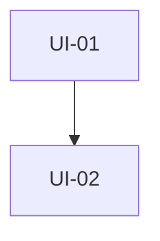

# Plan de desarrollo: skill para crear planes de implementación

## 1. Propósito

Crear una skill reutilizable para este repositorio que transforme un **PRD aprobado**, su **SPEC asociado** y el contexto técnico pertinente en un **plan de implementación ejecutable, verificable y trazable**.

La skill deberá convertir el alcance y los requisitos ya definidos en unidades coherentes de trabajo, ordenar sus dependencias, identificar qué puede ejecutarse en paralelo y describir cómo comprobar cada resultado. No implementará código ni sustituirá las decisiones de producto o técnicas contenidas en los documentos de origen.

El plan aprobado se guardará en `docs/planes/`. La carpeta `knowledge/` seguirá reservada exclusivamente para el trabajo y conocimiento de la persona usuaria.

## 2. Lugar dentro del flujo documental

La nueva skill completará la secuencia documental existente:

```text
crear-prd
    ↓
docs/prd/<iniciativa>-prd.md
    ↓
crear-spec
    ↓
docs/spec/<iniciativa>-spec.md
    ↓
crear-plan-implementacion
    ↓
docs/planes/<iniciativa>-plan-implementacion.md
    ↓
implementación y validación por unidades de trabajo
```

| Artefacto | Pregunta principal | Contenido |
| --- | --- | --- |
| PRD | ¿Qué se necesita, por qué y para quién? | Problema, valor, alcance, capacidades y éxito. |
| SPEC | ¿Cómo debe comportarse y construirse la solución? | Requisitos, flujos, interfaces, datos, errores y criterios de aceptación. |
| Plan de implementación | ¿En qué orden se realizará y cómo se demostrará cada avance? | Unidades de trabajo, dependencias, archivos previstos, validación y secuencia. |

La skill no reinterpretará el alcance del PRD ni completará decisiones técnicas ausentes del SPEC. Cuando detecte una contradicción o un vacío que impida planificar honestamente, lo marcará como bloqueante y recomendará actualizar primero el documento correspondiente.

## 3. Contexto y convenciones del repositorio

| Aspecto | Decisión |
| --- | --- |
| Idioma principal | Español, salvo que la persona usuaria solicite otro. |
| Fuente de alcance | Un PRD aprobado en `docs/prd/`. |
| Fuente funcional-técnica | Un SPEC aprobado en `docs/spec/`. |
| Destino de los planes | `docs/planes/`. |
| Fuente de la skill | `.agents/skills/crear-plan-implementacion/SKILL.md`. |
| Naturaleza del repositorio | Repositorio de harnesses, skills y documentación Markdown, con código auxiliar solo cuando se justifique. |
| Gestión externa de tareas | Fuera de alcance de la v1; el resultado será un archivo Markdown local. |
| Contenido de `knowledge/` | Puede consultarse solo si está enlazado desde las fuentes o si la persona lo indica; nunca se modifica ni se usa como destino. |

El plan deberá adaptarse al cambio real. No impondrá estimaciones por líneas de código, número fijo de subtareas, duración temporal ni una metodología externa. El tamaño adecuado se determinará por coherencia, dependencias, capacidad de verificación y cantidad de contexto necesaria para ejecutar cada unidad sin perder trazabilidad.

## 4. Principios y restricciones

- Leer completamente el PRD y el SPEC antes de proponer el plan.
- Comprobar que ambos documentos corresponden a la misma iniciativa y que el SPEC referencia al PRD correcto.
- Respetar el alcance, las exclusiones, los requisitos y las decisiones confirmadas.
- No inventar arquitectura, archivos, componentes, pruebas, dependencias ni estimaciones.
- Diferenciar información confirmada, `Supuesto`, `Pendiente`, `Por validar` y `Bloqueante`.
- Revisar únicamente la superficie del repositorio necesaria para ubicar el cambio y validar dependencias.
- Favorecer unidades verticales que produzcan un resultado comprobable, evitando separar artificialmente por capas cuando eso impida validar valor o comportamiento.
- Evitar que dos unidades declaradas como paralelas modifiquen la misma responsabilidad o dependan de contratos todavía inestables.
- Mantener trazabilidad explícita desde cada unidad hacia requisitos (`RF-XX`), criterios de aceptación (`CA-XX`) y, cuando sea útil, capacidades del PRD.
- Incluir validación, pruebas y documentación dentro de la unidad que introduce el comportamiento, no como una fase genérica separada salvo justificación.
- No modificar código, configuración, PRD, SPEC ni contenido de `knowledge/`.
- Mostrar el borrador, la ruta y los cambios previstos antes de escribir.
- No sobrescribir un plan existente sin releerlo, explicar los cambios y obtener aprobación explícita.
- Utilizar enlaces Markdown relativos únicamente a fuentes realmente consultadas.
- No presentar como listo un plan con decisiones bloqueantes sin resolver.

## 5. Resultado esperado de la primera versión

Al invocar la skill, el agente deberá:

1. Solicitar o identificar las rutas del PRD y del SPEC.
2. Leer ambos documentos por completo y comprobar su relación.
3. Extraer alcance, exclusiones, requisitos, criterios de aceptación, decisiones, riesgos y pendientes.
4. Determinar si la documentación está suficientemente madura para planificar.
5. Inspeccionar la estructura y los archivos pertinentes del repositorio para conocer el estado actual y las zonas afectadas.
6. Construir una matriz inicial de cobertura entre requisitos, criterios y cambios previstos.
7. Dividir el trabajo en unidades de implementación coherentes y comprobables.
8. Identificar dependencias, puntos de integración, conflictos potenciales y oportunidades reales de paralelismo.
9. Proponer una secuencia de ejecución por etapas.
10. Presentar el borrador completo del plan y solicitar aprobación explícita.
11. Guardar el documento aprobado en `docs/planes/`.
12. Informar bloqueos, supuestos, riesgos y la primera unidad recomendada para comenzar.

## 6. Alcance funcional

### Incluido

- Creación, revisión y actualización de planes de implementación.
- Lectura coordinada de un PRD y un SPEC de la misma iniciativa.
- Detección de inconsistencias entre producto, especificación y estado actual del repositorio.
- Exploración técnica acotada de archivos, módulos, pruebas, configuración y documentación pertinentes.
- Descomposición en unidades de trabajo con resultados verificables.
- Trazabilidad a requisitos y criterios de aceptación.
- Identificación de archivos o zonas probablemente afectadas, señalando la incertidumbre cuando corresponda.
- Registro de dependencias y orden de ejecución.
- Identificación prudente de trabajo paralelizable.
- Integración de pruebas, documentación y validaciones dentro de cada unidad.
- Definición de una comprobación final de integración y cobertura.
- Uso de Mermaid o texto para representar dependencias cuando aporte claridad.

### Excluido en la v1

- Implementación de código o modificación de configuración.
- Creación automática de issues en Jira, GitHub, Linear u otros sistemas.
- Estimaciones de horas, fechas o velocidad de equipos.
- Imposición de tamaños basados en líneas de código o número fijo de subtareas.
- Modificación automática del PRD o del SPEC.
- Resolución unilateral de decisiones de producto o arquitectura pendientes.
- Planificación detallada de una unidad dependiente sobre contratos que aún no estén definidos o estabilizados.
- Gestión de ramas, worktrees, commits, despliegues o estados de ejecución.
- Modificación, movimiento o clasificación de contenido en `knowledge/`.

## 7. Concepto de unidad de implementación

La skill utilizará el término **unidad de implementación** para cada parte ejecutable del plan. Una unidad adecuada deberá:

- perseguir un único resultado técnico o de comportamiento;
- cubrir uno o varios requisitos relacionados sin mezclar preocupaciones independientes;
- poder implementarse y revisarse con un conjunto acotado de contexto;
- producir evidencia verificable de terminación;
- incluir las pruebas y ajustes documentales necesarios para el cambio que introduce;
- declarar claramente qué necesita de otras unidades;
- evitar dejar el repositorio en un estado deliberadamente roto entre unidades, salvo que el plan describa una estrategia segura de integración.

No será obligatorio que toda unidad sea desplegable por separado. Sí deberá ser integrable y comprobable de forma honesta. Cuando un cambio transversal sea demasiado grande, se preferirá primero una trayectoria mínima de extremo a extremo y luego ampliaciones incrementales, siempre que el SPEC permita esa secuencia.

Cada unidad tendrá un identificador estable (`UI-01`, `UI-02`, etc.) y contendrá como mínimo:

- objetivo y resultado observable;
- requisitos y criterios cubiertos;
- alcance incluido y excluido;
- cambios previstos por componente o archivo;
- pasos de implementación suficientemente concretos;
- pruebas o evidencia de validación;
- dependencias y condiciones de entrada;
- riesgos o decisiones pendientes propias;
- condición de terminación.

## 8. Flujo conversacional propuesto

### Fase A: validar las fuentes

1. Determinar si se crea un plan nuevo o se revisa uno existente.
2. Solicitar las rutas del PRD y del SPEC si no se indicaron.
3. Leer ambos documentos completamente.
4. Comprobar:
   - que el SPEC enlaza o corresponde al PRD indicado;
   - que objetivos, alcance y exclusiones son compatibles;
   - que los requisitos y criterios relevantes son identificables;
   - que no quedan bloqueos que impidan decidir la secuencia o los límites del trabajo.
5. Si existe un plan previo, leerlo completamente y distinguir qué se conserva, qué cambia y por qué.
6. Presentar las contradicciones o carencias antes de continuar. No corregir silenciosamente las fuentes.

### Fase B: orientar el plan en el repositorio

1. Partir de los componentes, interfaces, datos y dependencias nombrados por el SPEC.
2. Inspeccionar solo los directorios y archivos necesarios para determinar:
   - qué existe actualmente;
   - dónde se ubicarían los cambios;
   - qué contratos o responsabilidades se comparten;
   - qué pruebas y convenciones ya utiliza el repositorio;
   - qué dependencias reales condicionan el orden.
3. Consultar `AGENTS.md`, README u otras instrucciones locales aplicables a las zonas afectadas.
4. Contrastar el SPEC con el código y la configuración actuales. Registrar diferencias relevantes como riesgo, pendiente o bloqueo.
5. Evitar una exploración completa del repositorio si no es necesaria para elaborar un plan fiable.

### Fase C: descomponer y ordenar

1. Construir una matriz de cobertura de `RF-XX` y `CA-XX`.
2. Agrupar cambios por resultados comprobables y límites técnicos reales.
3. Crear unidades verticales cuando permitan validar comportamiento de extremo a extremo.
4. Separar una unidad cuando:
   - tenga más de un resultado independiente;
   - dependa de decisiones diferentes;
   - mezcle zonas del repositorio sin una razón funcional común;
   - no pueda probarse o revisarse de manera clara;
   - requiera estabilizar primero un contrato o una migración.
5. Unir unidades cuando separarlas cree pasos sin resultado verificable o duplique contexto y validación.
6. Definir dependencias obligatorias y distinguirlas de simples preferencias de orden.
7. Marcar como paralelas solo las unidades sin dependencia mutua, sin contratos inestables compartidos y con bajo riesgo de conflicto sobre las mismas responsabilidades.
8. Ordenar el trabajo en etapas de ejecución. Las unidades dependientes se detallarán con la evidencia disponible y se revisarán después de materializar cambios que puedan alterar su plan.
9. Añadir una comprobación final de integración, trazabilidad y regresión.

### Fase D: redactar, aprobar y guardar

1. Redactar el plan con la plantilla base.
2. Verificar que todos los requisitos y criterios dentro del alcance estén cubiertos o explícitamente justificados como pendientes o excluidos.
3. Comprobar que cada unidad tenga resultado, cambios, validación, dependencias y condición de terminación.
4. Mostrar el borrador, la ruta propuesta y todos los archivos que se crearían o actualizarían.
5. Solicitar aprobación explícita antes de escribir.
6. Tras la aprobación, releer el destino si ya existe y comprobar que no cambió.
7. Crear `docs/planes/` si es necesario y guardar el Markdown aprobado.
8. Validar los enlaces relativos y comunicar la primera etapa recomendada, los bloqueos y las revisiones futuras necesarias.

## 9. Estructura base del plan generado

````markdown
# Plan de implementación: <nombre de la iniciativa>

## Resumen
<Resultado que se implementará y enfoque general de ejecución.>

## Fuentes y alcance
- PRD: [<nombre>](../prd/<nombre>-prd.md)
- SPEC: [<nombre>](../spec/<nombre>-spec.md)
- Alcance incluido:
- Exclusiones relevantes:
- Fuentes técnicas revisadas:

## Estado actual y brechas
- Estado actual del repositorio:
- Capacidades reutilizables:
- Brechas respecto del SPEC:
- Supuestos o bloqueos:

## Estrategia de implementación
<Principios de descomposición, orden e integración aplicables a esta iniciativa.>

## Matriz de cobertura
| Requisito / criterio | Unidad | Evidencia prevista |
| --- | --- | --- |
| RF-01 / CA-01 | UI-01 | <prueba o comprobación> |

## Unidades de implementación

### UI-01 — <resultado concreto>
- **Objetivo:**
- **Cubre:** RF-XX, CA-XX.
- **Incluye:**
- **No incluye:**
- **Cambios previstos:**
  - `<ruta o componente>`: <responsabilidad del cambio>.
- **Pasos:**
  1.
- **Validación:**
  -
- **Depende de:** ninguna / UI-XX / decisión pendiente.
- **Puede ejecutarse en paralelo con:** ninguna / UI-XX.
- **Riesgos o pendientes:**
- **Terminado cuando:**

## Dependencias y secuencia


### Etapa 1
- UI-01

### Etapa 2
- UI-02, después de completar y validar UI-01.

## Validación integral
- Pruebas de regresión:
- Comprobación de integración:
- Revisión de trazabilidad:
- Documentación que debe quedar actualizada:

## Riesgos y decisiones pendientes
- Bloqueante:
- Por validar:
- Supuesto:

## Criterio de finalización del plan
- [ ] Todos los RF y CA incluidos tienen evidencia.
- [ ] Las pruebas definidas están aprobadas.
- [ ] No quedan regresiones conocidas dentro del alcance.
- [ ] La documentación afectada está actualizada.
````

La plantilla será proporcional al cambio. El diagrama podrá omitirse si una lista expresa mejor una secuencia sencilla. No se crearán secciones vacías para aparentar exhaustividad.

## 10. Diseño de archivos

La primera entrega tendrá una única fuente de instrucciones:

```text
.agents/
└── skills/
    └── crear-plan-implementacion/
        └── SKILL.md
```

`SKILL.md` deberá contener:

- frontmatter válido con `name: crear-plan-implementacion` y una descripción de activación precisa;
- propósito, límites y relación con `crear-prd` y `crear-spec`;
- reglas documentales y de trazabilidad;
- criterios de preparación del PRD y el SPEC;
- orientación acotada sobre el repositorio;
- reglas para formar unidades de implementación;
- análisis de dependencias y paralelismo;
- flujo de cuatro fases;
- plantilla del plan;
- casos especiales y comprobación previa al guardado.

No se añadirá Python en la primera versión. Solo se evaluará una utilidad en `src/` si las pruebas demuestran una necesidad repetitiva y determinista, como validar cobertura de identificadores, enlaces o ciclos en dependencias.

## 11. Plan de implementación de la skill

| Etapa | Actividades | Entregable | Criterio de salida |
| --- | --- | --- | --- |
| 1. Alinear | Confirmar nombre, destino, nomenclatura de unidades y política de aprobación. | Decisiones documentadas. | No quedan dudas que alteren el flujo o los archivos. |
| 2. Especificar | Definir entradas, controles de preparación, reglas de descomposición, trazabilidad y plantilla. | Borrador de `SKILL.md`. | El flujo distingue claramente PRD, SPEC y plan. |
| 3. Implementar | Crear `.agents/skills/crear-plan-implementacion/SKILL.md`. | Fuente única de la skill. | Frontmatter válido e instrucciones coherentes con las skills existentes. |
| 4. Probar | Ejecutar escenarios nominales, incompletos, contradictorios y de actualización. | Registro de resultados y defectos. | No inventa decisiones ni implementa cambios. |
| 5. Ajustar | Refinar tamaño de unidades, cobertura, dependencias y preguntas. | v1 estable. | Los planes son ejecutables sin imponer una metodología ajena. |
| 6. Documentar | Registrar el flujo PRD → SPEC → plan y los límites de la v1. | Documentación final. | Una persona puede usar las tres skills secuencialmente. |

## 12. Casos de prueba de aceptación

1. **Flujo nominal:** con PRD y SPEC aprobados y coherentes, genera un plan trazable en `docs/planes/`.
2. **PRD ausente:** no reconstruye el producto desde el SPEC; solicita el PRD y recomienda `crear-prd`.
3. **SPEC ausente:** no sustituye la especificación con un plan; recomienda `crear-spec`.
4. **Fuentes incompatibles:** detecta que PRD y SPEC pertenecen a iniciativas distintas o tienen alcance contradictorio.
5. **SPEC con bloqueos:** identifica decisiones que impiden planificar contratos, datos, seguridad o integración y no presenta el plan como listo.
6. **Repositorio mínimo:** puede planificar cambios documentales o de skills aunque exista poco código, sin inventar componentes.
7. **Exploración acotada:** revisa solo las zonas pertinentes y registra las fuentes técnicas realmente utilizadas.
8. **Trazabilidad:** todos los `RF-XX` y `CA-XX` dentro del alcance aparecen en la matriz o tienen una exclusión justificada.
9. **Unidad demasiado amplia:** separa resultados independientes o dependencias distintas en unidades diferentes.
10. **Fragmentación artificial:** evita crear unidades de “solo pruebas” o “solo documentación” cuando pertenecen al mismo comportamiento.
11. **Paralelismo falso:** no declara paralelas unidades que comparten un contrato inestable o la misma responsabilidad central.
12. **Cambio secuencial:** ordena primero una interfaz o migración necesaria y después las unidades consumidoras.
13. **Plan existente:** relee el archivo, conserva decisiones vigentes y explica el impacto antes de pedir aprobación para sobrescribir.
14. **Solicitud de implementación:** finaliza y aprueba el plan antes de tratar cualquier cambio de código en una acción separada.
15. **Información desconocida:** marca rutas o pruebas como `Por validar` en lugar de presentarlas como hechos.
16. **Seguridad documental:** no modifica PRD, SPEC, código, configuración ni `knowledge/`.
17. **Enlaces relativos:** enlaza correctamente PRD, SPEC y fuentes locales desde `docs/planes/`.
18. **Plan sencillo:** permite una única unidad cuando el cambio es pequeño, coherente y completamente verificable.

## 13. Decisiones que deben confirmarse durante el desarrollo

- Nombre definitivo de la skill: se propone `crear-plan-implementacion`.
- Destino definitivo: se propone `docs/planes/`.
- Si los planes requerirán un estado documental o revisión humana adicional antes de ejecutarse.
- Si la matriz de cobertura será obligatoria para todo plan o solo para SPEC con varios requisitos.
- Si una futura versión deberá exportar unidades a un gestor de tareas.
- Si se incorporará una validación automática de identificadores, enlaces y ciclos de dependencia.
- Si las unidades ejecutadas actualizarán el mismo plan con estado y evidencia o si esa función pertenecerá a otra skill.

Estas decisiones no impiden redactar la primera versión de `SKILL.md`, pero deberán permanecer explícitas hasta su confirmación.

## 14. Definición de terminado de la v1

La v1 estará terminada cuando la skill pueda leer un PRD y un SPEC aprobados, comprobar su coherencia, orientarse de forma acotada en el repositorio y producir un plan Markdown trazable en `docs/planes/`.

El plan deberá dividir el trabajo en unidades coherentes y verificables, cubrir los requisitos y criterios dentro del alcance, representar dependencias reales, distinguir el trabajo secuencial del paralelizable e integrar las pruebas y la documentación correspondientes. La skill no deberá inventar decisiones, imponer tamaños artificiales, modificar fuentes o código ni escribir el plan sin aprobación explícita.
